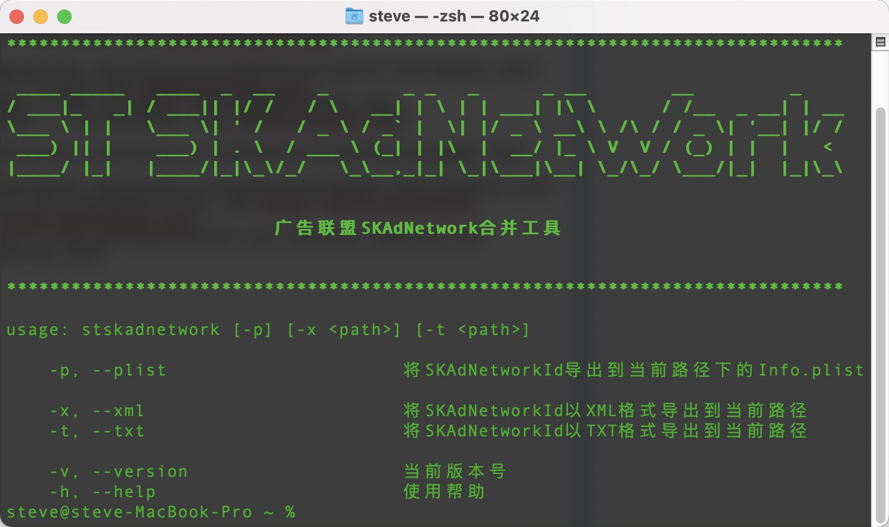

# stskadnetwork



[](https://github.com/guojunliu/homebrew-stskadnetwork)
[](https://github.com/guojunliu/homebrew-stskadnetwork)
[](https://github.com/guojunliu/homebrew-stskadnetwork)
[](https://github.com/guojunliu/homebrew-stskadnetwork)
[](https://github.com/guojunliu/homebrew-stskadnetwork)
[](https://github.com/guojunliu/homebrew-stskadnetwork)


针对运行 iOS 14 或更高版本的用户的游戏必须在Info.plist文件中实现广告商网络 ID 。包含一系列经过验证的网络 ID 使广告来源能够通过 Apple 的SKAdNetwork框架正确地归因其广告支出。

在`Info.plist`文件中添加SKAdNetworkIdentifier时有以下几个特点

- 广告联盟众多，较为繁琐
- 广告联盟会有交叉的`SKAdNetworkIdentifier`，需要去重
- 广告联盟会不定时更新

本工具可以从各广告联盟直接抓取`SKAdNetworkIdentifier`，去重后，直接写入项目的`Info.plist`中，方便快捷


```
usage: stskadnetwork [-p] [-x <path>] [-t <path>]

    -p, --plist                      将SKAdNetworkId导出到当前路径下的Info.plist

    -x, --xml                        将SKAdNetworkId以XML格式导出到当前路径
    -t, --txt                        将SKAdNetworkId以TXT格式导出到当前路径
```